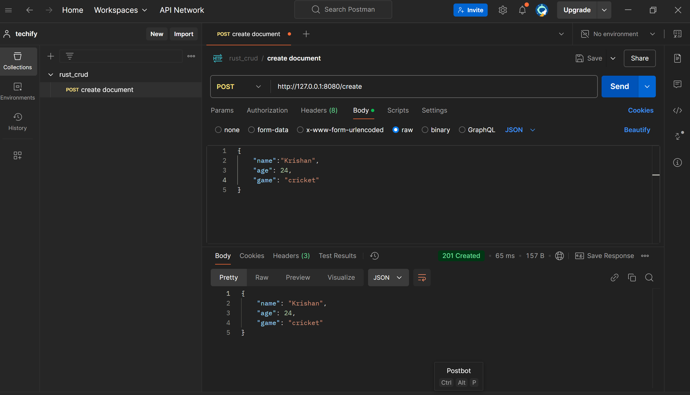
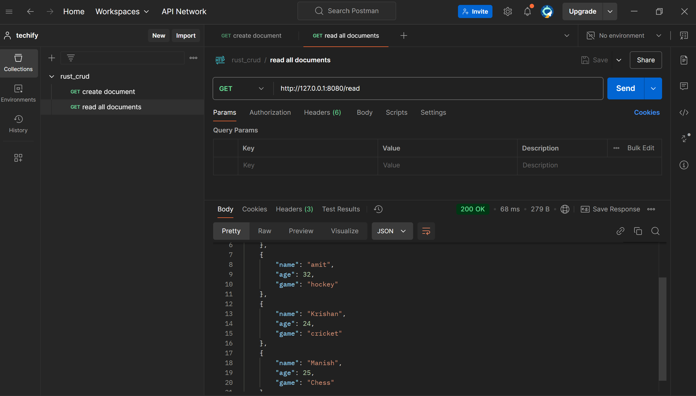
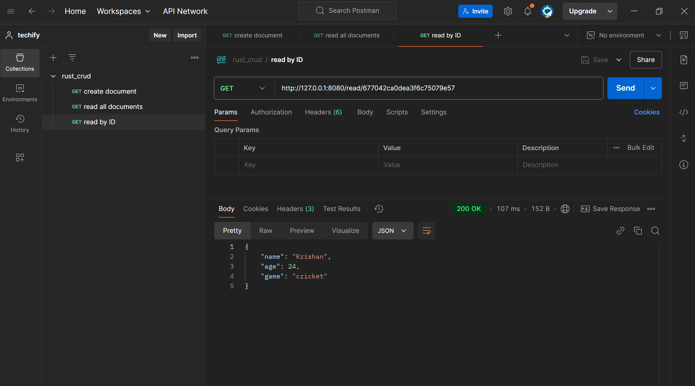
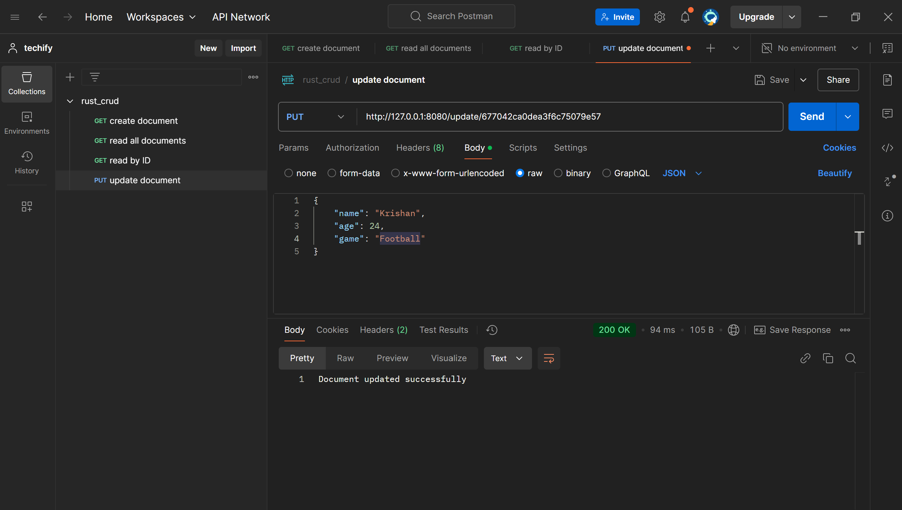
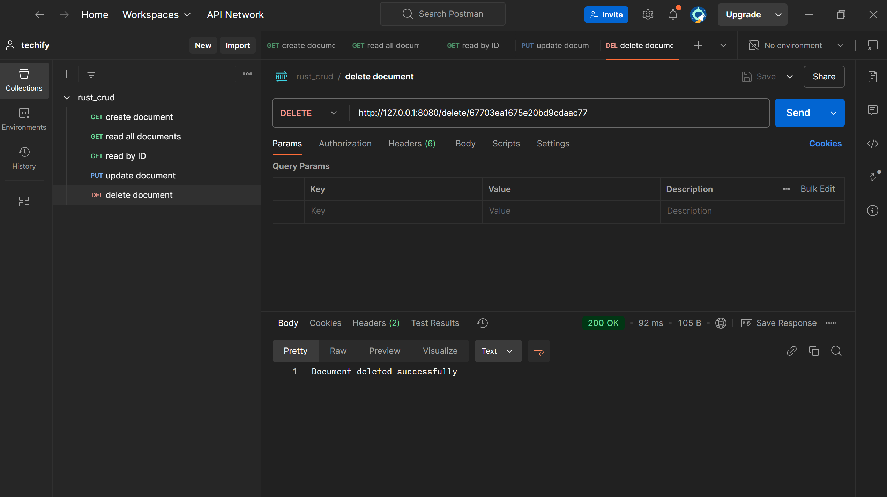

# rust_crud_operations

This reposiroty contains the code for the `crud`  operations in the rust. `MongoDB` is used as the  database with the database name `db1` and collection name `collection1`.

## SETUP

1. Clone the repository:

   ```bash
   git clone https://github.com/krishansinghal/rust_crud_operations
   ```

2. Navigate to the project directory:

   ```bash
   cd rust_crud
   ```

3. Install the dependencies:

   ```bash
   cargo build
   ```

4. Set up .env file:
   - Create a `.env` file in the root directory and add the following variables:

   ```bash
   MONGODB_URI=YOUR_CONNECTION_STRING
   ```
   To access the "db1" database and the "collection1" collection.

   `Note: Make sure your mongodb is running and connected before starting the server.`


### Deployment

After the succesful connecting with the DB. Run the following command in terminal:
```bash
cargo run
```
- This will start the server at ` http://127.0.0.1:8080`. You can see this message `Server is running on http://127.0.0.1:8080` in the terminal.

### Postman

Open the `Postman` application and perform the crud operation.

1) Create documents: using this operation `new document` can be created into the database. The details of operation is as follow:
- HTTP method: `POST`.
- API Endpoint: `http://127.0.0.1:8080/create`.
- JSON Input: 
```bash
{
    "name":"Krishan",
    "age": 25,
    "game": "Chess"
}
```
#### Result: 


2) Read documents: All data can be fetched using this operation. The details of operation is as follow:
- HTTP method: `GET`.
- API Endpoint: `http://127.0.0.1:8080/read`.

#### Result: 


3) Read documents by ID: data of a specific ID can be fetched using this operation. The details of operation is as follow:
- HTTP method: `GET`.
- API Endpoint: `http://127.0.0.1:8080/read/<ID>`.

#### Result: 


4) Update documents: Any data value of a specific ID can be update using this operation. The details of operation is as follow:
- HTTP method: `PUT`.
- API Endpoint: `http://127.0.0.1:8080/update/<ID>`.
- JSON Input:
```bash
{
    "name":"Manish",
    "age": 25,
    "game": "Chess"
}
```
#### Result: 


5) Delete document: Data  of a specific Id can be deleted using this operation. The details of operation is as follow:
- HTTP method: `DELETE`.
- API Endpoint: `http://127.0.0.1:8080/delete/<ID>`.

#### Result: 



#### Published Postman collection
```bash
https://web.postman.co/workspace/e138b6c6-df57-4a5e-94f3-418a39bdaa27/request/31724378-ffa88b7c-207a-4aa6-904b-cfafa3d865b7
```


